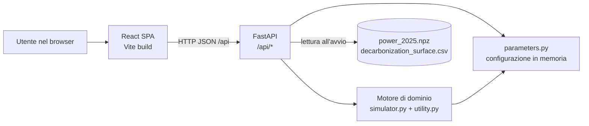
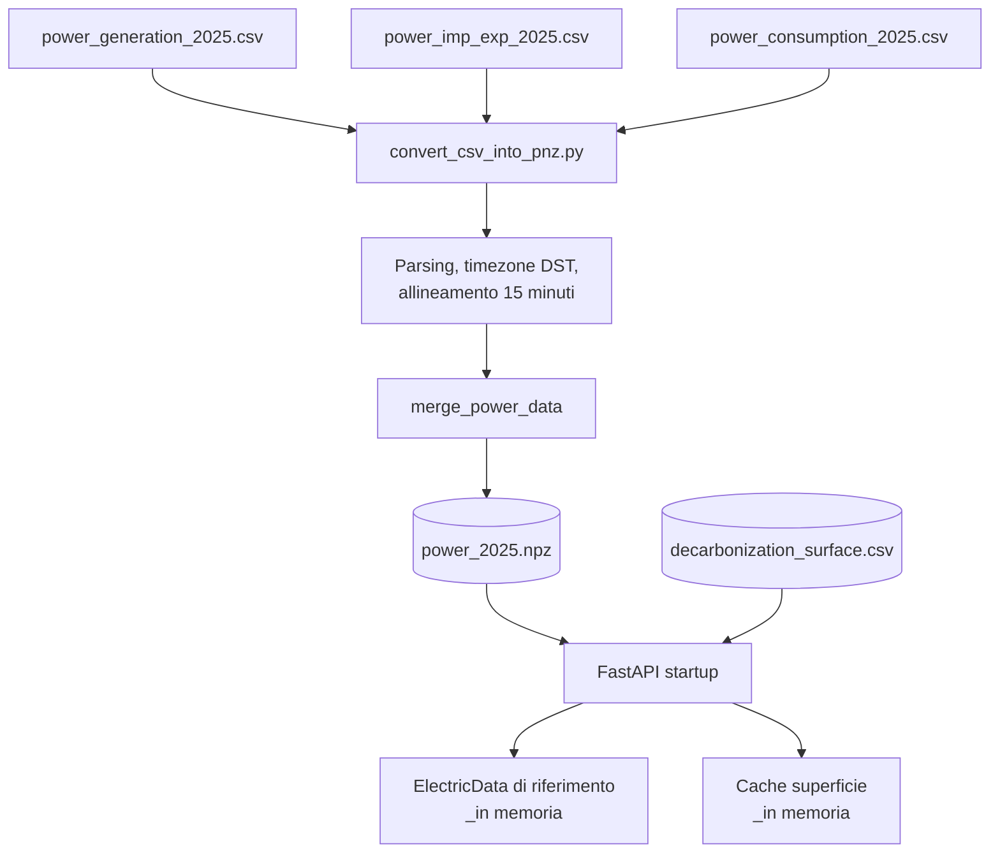
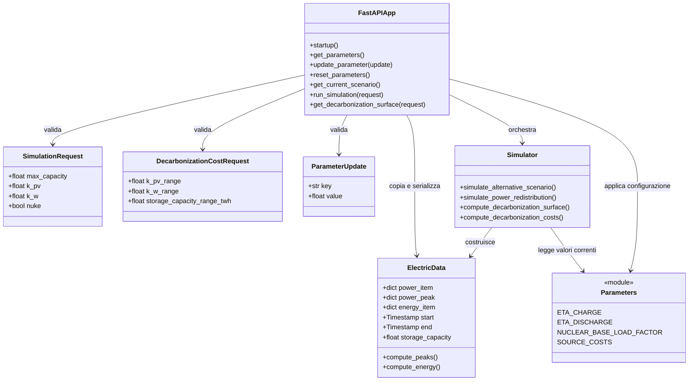
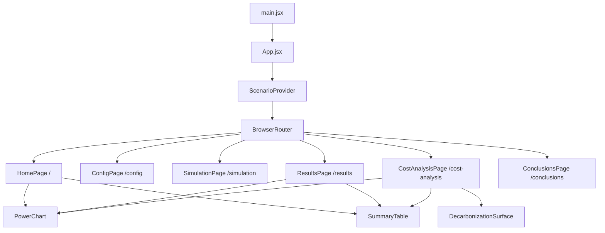
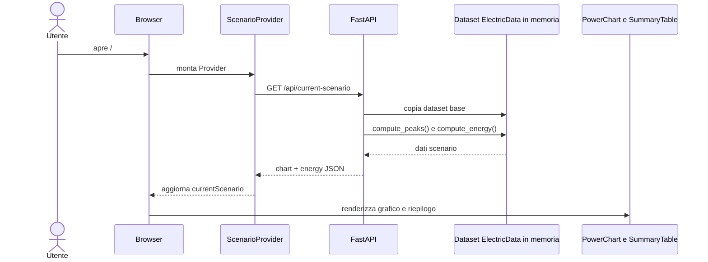
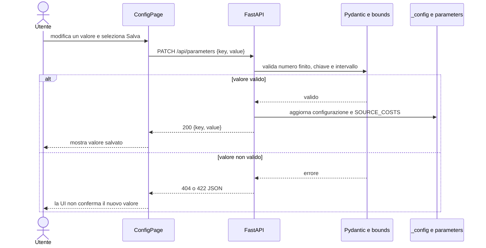
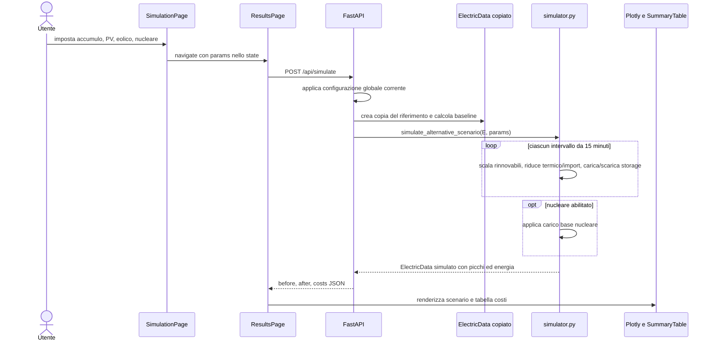
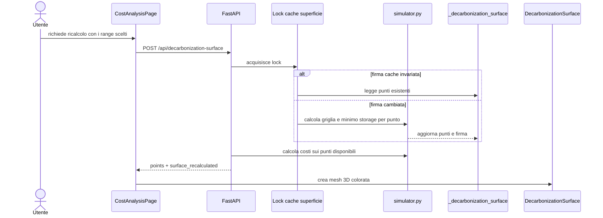
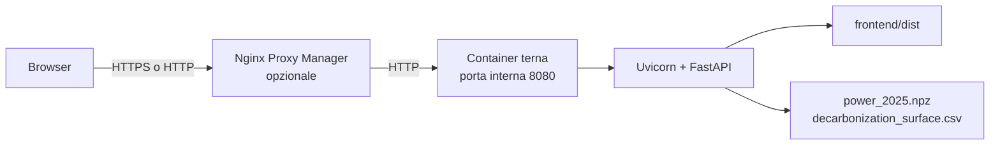
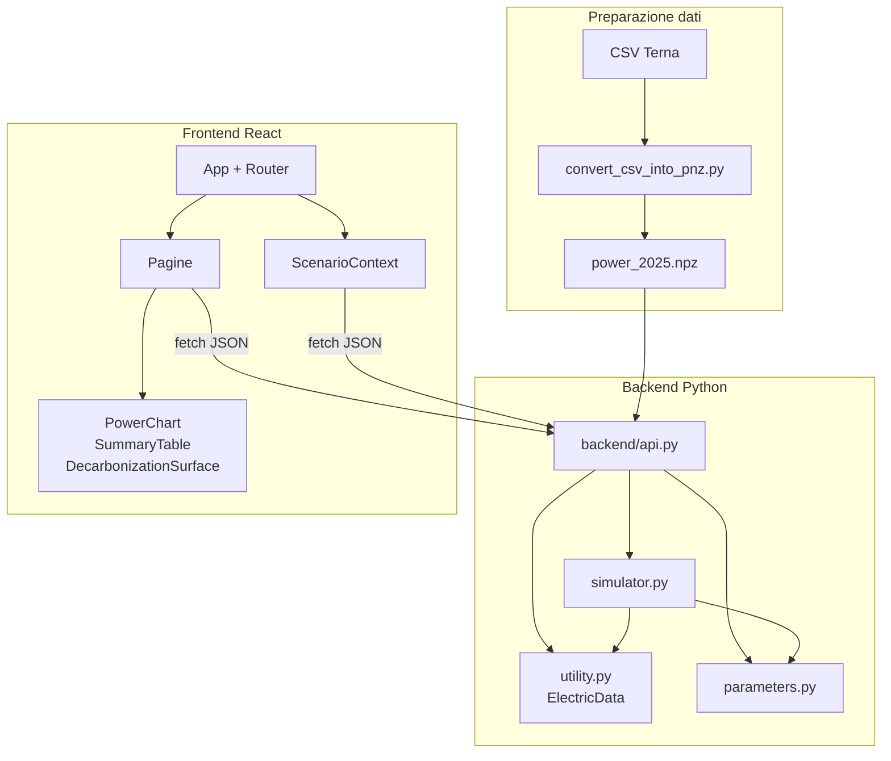

# Architettura della webapp Terna Energy Simulator

## 1. Scopo e visione d'insieme

La webapp permette di analizzare il bilancio elettrico italiano del 2025 e di simulare scenari alternativi in cui cambiano la capacità di accumulo, la potenza fotovoltaica ed eolica e l'eventuale contributo nucleare. A partire dalla serie storica a granularità di 15 minuti, l'applicazione restituisce grafici temporali, riepiloghi energetici ed economici e una superficie degli scenari che consentono la decarbonizzazione senza nucleare.

L'architettura adotta un modello **client-server a processo unico in produzione**:

- il frontend è una Single Page Application (SPA) React compilata da Vite;
- il backend è un servizio FastAPI che espone endpoint JSON sotto il prefisso `/api`;
- nello stesso processo FastAPI vengono serviti sia l'API sia gli asset statici compilati della SPA;
- il motore numerico Python legge dati locali pre-elaborati, effettua le simulazioni con NumPy/Pandas e non usa database o servizi remoti a runtime.

La separazione logica tra presentazione, API e dominio resta netta, pur essendo distribuita in un solo container quando l'applicazione viene pubblicata. Questo riduce la complessità operativa: l'utente accede a un unico origin e le richieste relative come `fetch('/api/...')` funzionano senza configurazioni del browser aggiuntive.



## 2. Repository e responsabilita dei moduli

| Area | File/modulo principale | Responsabilita |
| --- | --- | --- |
| Ingestione offline | `convert_csv_into_pnz.py` | Legge i tre CSV Terna, li normalizza/allinea e costruisce l'archivio `power_2025.npz`. |
| Modello dati | `utility.py` | Definisce `ElectricData`, carica/salva dati, calcola picchi ed energia e contiene gli adattatori CSV/NPZ. |
| Parametri di dominio | `parameters.py` | Definisce rendimenti, costi, fonti, colori e valori iniziali del modello. |
| Simulazione | `simulator.py` | Ridistribuisce la potenza per ogni intervallo, calcola scenari, fattibilita e superficie di decarbonizzazione. |
| API e hosting web | `backend/api.py` | Carica le risorse, valida i request body, orchestra dominio/cache/configurazione, applica CORS/rate limit e serve la SPA in produzione. |
| Interfaccia | `frontend/src/` | Routing, stato di scenario, form utente e visualizzazioni Plotly. |
| Packaging | `Dockerfile`, `docker-compose.yml`, `render.yaml` | Costruzione frontend, generazione NPZ, esecuzione Uvicorn e pubblicazione del servizio. |

## 3. Ciclo di vita e dati di input

I CSV `power_generation_2025.csv`, `power_imp_exp_2025.csv` e `power_consumption_2025.csv` sono la sorgente grezza. Lo script di conversione esegue una fase che appartiene al build/deployment, non alla normale richiesta HTTP:

1. carica produzione, import/export e consumi con Pandas;
2. converte le date, gestendo l'ora legale italiana in una base temporale continua;
3. ricostruisce per ogni sorgente una griglia comune con passo di 15 minuti e conserva eventuali dati assenti come `NaN`;
4. unisce le serie in un solo oggetto `ElectricData`;
5. serializza serie e metadati temporali in `power_2025.npz`.

Nel `Dockerfile`, questa conversione e eseguita durante la build dell'immagine. Il processo applicativo non analizza di nuovo i CSV: all'evento FastAPI `startup` legge una volta `power_2025.npz`, calcola il riepilogo energetico di riferimento e legge la superficie precomputata da `decarbonization_surface.csv`.



### 3.1 Unita e risoluzione

Le serie `power_item` rappresentano potenze in GW. Con 15 minuti per campione, l'integrazione dell'energia usa la divisione per 4000, producendo GWh. I riepiloghi di costo sono annualizzati sulla durata effettiva del dataset e convertiti in GEUR/anno tramite il fattore `1e-6`. La capacita di accumulo richiesta dall'API di simulazione e espressa in GWh; nella ricerca della superficie l'interfaccia invia TWh e l'API li converte in GWh.

## 4. Backend

### 4.1 Composizione del servizio FastAPI

`backend/api.py` e il punto di ingresso applicativo. Costruisce `app = FastAPI(...)`, registra middleware e route e, solo se esiste `frontend/dist`, monta `StaticFiles` alla radice. Il mount statico e volutamente dichiarato dopo le route `/api/*`: Starlette valuta le route in ordine, pertanto gli endpoint API hanno priorita sugli asset e sul fallback HTML della SPA.

All'avvio vengono inizializzate quattro risorse condivise dal processo:

- `_power_data_2025`: dataset base `ElectricData`, letto dall'NPZ;
- `_decarbonization_surface`: punti inizialmente caricati dal CSV e poi ricalcolabili;
- `_decarbonization_surface_signature`: firma degli input che rendono valida la cache della superficie;
- `_config`: copia mutabile dei default di `parameters.py`.

L'API non modifica mai il dataset base durante una simulazione. `_get_power_data_copy()` copia gli array NumPy prima di passarli al simulatore: una richiesta lavora quindi sulla propria istanza `ElectricData`, mentre l'oggetto precaricato resta disponibile per le richieste successive.



### 4.2 Contratti REST

Tutti gli endpoint restituiscono JSON e usano il prefisso `/api`. I modelli Pydantic convalidano i corpi delle richieste, compresi i limiti numerici e il rifiuto di valori non finiti.

| Metodo e route | Input | Risposta | Uso nel frontend |
| --- | --- | --- | --- |
| `GET /api/parameters` | Nessuno | Array con chiave, etichetta, unita, default, valore corrente, descrizione e motivazione | Caricamento di `ConfigPage`. |
| `PATCH /api/parameters` | `{ key, value }` | Chiave e valore aggiornato | Salvataggio puntuale di un parametro. |
| `POST /api/parameters/reset` | Nessuno | Stesso array di `GET /api/parameters` | Ripristino dei default. |
| `GET /api/current-scenario` | Nessuno | `{ chart, energy }` per i dati reali 2025 | Inizializzazione dell'home page tramite contesto. |
| `POST /api/simulate` | `{ max_capacity, k_pv, k_w, nuke }` | `{ before, after, costs }` | Scenario interattivo e scenario nucleare di confronto. |
| `POST /api/decarbonization-surface` | Range di PV, eolico e accumulo | `{ surface_recalculated, points }` | Grafico 3D nell'analisi costi. |

`chart` ha la forma seguente:

```json
{
  "start": "2025-01-01T00:00:00",
  "step_minutes": 15,
  "n": 35040,
  "series": { "Photovoltaic": [0.0], "Consumption": [0.0] },
  "peaks": { "Photovoltaic": { "value": 0.0, "time": "2025-01-01 12:00" } }
}
```

Le serie NumPy non vengono inviate direttamente: l'adattatore `_power_data_to_dict()` le trasforma in liste JSON; `_energy_to_dict()` converte le tuple interne `(energia, costo)` in oggetti con campi nominati. Questo isola il contratto web dalla rappresentazione numerica Python.

### 4.3 Configurazione mutabile e costi

I default sono catturati una volta in `_DEFAULTS`. Ogni aggiornamento valida la chiave contro `_PARAM_BOUNDS`, aggiorna `_config` e invoca `_apply_config()`. Quest'ultima propaga il valore sia al modulo `parameters` sia al namespace di `simulator`, che ha importato alcune costanti per nome; inoltre aggiorna `SOURCE_COSTS` per i parametri economici.

La configurazione e **globale al processo**, non e associata al browser, a un utente o a una sessione HTTP. Di conseguenza, una modifica nella pagina di configurazione influenza le simulazioni e i calcoli di costo effettuati successivamente da tutti i client collegati alla stessa istanza. Il riavvio del processo ripristina i valori in `parameters.py`, salvo modifiche al codice o a una futura persistenza esplicita.

### 4.4 Motore di simulazione

`simulate_alternative_scenario()` percorre tutti gli intervalli temporali. Per ciascun campione, `simulate_power_redistribution()` segue questa priorita:

1. scala la potenza storica di fotovoltaico ed eolico con `k_pv` e `k_w`;
2. usa il surplus per ridurre prima la produzione termica, poi le importazioni;
3. carica l'accumulo residuo fino a `max_capacity`, applicando `ETA_CHARGE`;
4. scarica l'accumulo per coprire termico e poi importazioni, applicando `ETA_DISCHARGE`;
5. se `nuke` e vero, trasferisce il termico residuo alla sorgente nucleare.

Al termine del ciclo, se il nucleare e attivo, viene applicato un post-processing di carico base: la produzione nucleare minima e `NUCLEAR_BASE_LOAD_FACTOR` moltiplicato per il suo picco. L'eventuale surplus nucleare riduce dapprima la scarica dell'accumulo e poi le importazioni. Infine viene costruito un nuovo `ElectricData`, su cui vengono ricalcolati picchi ed energia.

### 4.5 Ricerca della superficie di decarbonizzazione e cache

L'endpoint della superficie usa `compute_decarbonization_surface()`, che esplora una griglia di fattori PV/eolico. Per ogni combinazione, `compute_decarbonization_minimum_storage_capacity()` verifica la fattibilita e usa una bisezione per stimare il minimo accumulo necessario. Uno scenario e fattibile senza nucleare solo quando termico e import sono nulli in tutti gli intervalli.

Il risultato puo essere oneroso, perche richiede molte simulazioni su un anno di campioni. Per questo l'API conserva i punti in memoria e protegge lettura/ricalcolo con `_decarbonization_surface_lock`. La cache e valida finche restano uguali rendimenti di carica/scarica e i tre range della richiesta; i costi vengono invece calcolati sulla superficie disponibile a ogni risposta, cosi che un aggiornamento di LCOE/LCOS/import si rifletta nei valori economici anche senza rigenerare la parte di fattibilita.

### 4.6 Aspetti trasversali del backend

- **CORS:** le origini sono configurabili tramite `CORS_ALLOW_ORIGINS` e, per impostazione predefinita, e consentito `*`. In produzione same-origin non e necessario per il normale flusso della SPA, ma rimane utile per eventuali client esterni.
- **Rate limiting:** il middleware applica una finestra scorrevole in memoria per IP soltanto ai path `/api/`. I limiti sono configurabili con `RATE_LIMIT_REQUESTS` e `RATE_LIMIT_WINDOW_SECONDS`; al superamento restituisce HTTP 429 e `Retry-After`.
- **IP client:** l'API considera `x-real-ip` e `x-forwarded-for` quando sono inseriti dal proxy interno, altrimenti usa l'host della connessione.
- **Errori di validazione:** FastAPI/Pydantic restituisce automaticamente errori 422 per request body non conformi; chiavi parametro inesistenti ottengono 404.

## 5. Frontend

### 5.1 Stack e bootstrap

Il client e sviluppato con React 19, React Router 7, Vite 8 e Plotly tramite `react-plotly.js`. `src/main.jsx` monta `App`, il quale avvolge il router in `ScenarioProvider`. `App.jsx` dichiara le sei route client-side: home, configurazione, simulazione, risultati, analisi costi e conclusioni.



### 5.2 Stato e navigazione

`ScenarioContext.jsx` esegue una sola richiesta `GET /api/current-scenario` quando viene montato il provider e pubblica `{ currentScenario, loading, error }`. In questo modo la home non deve implementare una propria logica di caricamento e lo stato di riferimento rimane disponibile alle pagine annidate nel provider.

Il form di `SimulationPage` mantiene localmente i quattro parametri dello scenario. Quando l'utente avvia la simulazione, i parametri vengono passati con `navigate('/results', { state: { params } })`. `ResultsPage` legge questo stato di navigazione e solo allora richiede `POST /api/simulate`; una visita diretta senza parametri torna alla home. I risultati non sono salvati nel contesto: vengono mantenuti nello stato locale della pagina risultati.

`ConfigPage` mantiene in stato locale l'elenco dei parametri, i valori editati e gli indicatori di salvataggio. Ogni pulsante salva un solo valore con `PATCH`; il ripristino usa il route `POST` dedicato. `CostAnalysisPage` conserva i range utente, il risultato della superficie e lo scenario nucleare di confronto; al montaggio lancia in parallelo concettuale la richiesta della superficie iniziale e la simulazione nucleare con accumulo zero e fattori rinnovabili pari a uno.

### 5.3 Componenti di presentazione

| Componente | Input principale | Responsabilita di visualizzazione |
| --- | --- | --- |
| `PowerChart` | `chartData`, `title` | Ricostruisce timestamp da `start`, `n` e `step_minutes`; disegna aree impilate per le sorgenti e linee per consumo/import/export. |
| `SummaryTable` | `energy`, `peaks` | Mostra energia, costo annuo, picco e data del picco; nasconde le sorgenti senza energia significativa. |
| `DecarbonizationSurface` | `points` | Trasforma i punti dell'API in un `mesh3d` Plotly con assi PV/eolico/accumulo e colore proporzionale al costo. |

I componenti di grafico non calcolano scenari: ricevono strutture serializzabili dall'API e si occupano solo di traduzione verso i trace Plotly. Questo evita di duplicare logica fisica o economica in JavaScript.

### 5.4 Sviluppo locale e produzione

In sviluppo, Vite e in ascolto sulla porta 5174 e inoltra `/api` a `http://localhost:8000` tramite proxy. Il browser continua quindi a effettuare richieste relative alla SPA, senza conoscere l'host del backend.

In produzione, `npm run build` genera `frontend/dist`. FastAPI monta questa directory alla radice dello stesso origin dell'API; non interviene quindi un proxy Vite. Il browser recupera `index.html` e gli asset compilati, mentre la stessa origine risponde alle chiamate `/api/*`.

## 6. Interazione frontend-backend

### 6.1 Caricamento dello scenario di riferimento



### 6.2 Configurazione di un parametro



### 6.3 Esecuzione di una simulazione



### 6.4 Calcolo della superficie di decarbonizzazione



## 7. Deployment

Il `Dockerfile` usa una build multi-stage:

1. un'immagine Node 20 installa le dipendenze del frontend con `npm ci` ed esegue `npm run build`;
2. un'immagine Python 3.11 installa le dipendenze FastAPI/NumPy/Pandas, copia il progetto, riceve `frontend/dist` dallo stage precedente e genera l'NPZ dai CSV;
3. Uvicorn avvia `backend.api:app` sulla porta interna 8080.

`docker-compose.yml` espone la porta interna come `${TERNA_PORT}:8080`, propaga le variabili CORS/rate limiting e applica `no-new-privileges:true` con `cap_drop: ALL`. Davanti a un Nginx Proxy Manager, un solo proxy host inoltra sia pagine sia API al container; non servono regole separate per `/api`.



## 8. Flussi, limiti e conseguenze architetturali

### Punti di forza

- **Distribuzione semplice:** una singola immagine e un singolo URL pubblicano client e server.
- **Separazione delle responsabilita:** React visualizza e raccoglie input; Python esegue validazione, modello e calcolo numerico.
- **Prestazioni ragionevoli per il dataset fisso:** l'NPZ viene letto una sola volta e le simulazioni lavorano su copie in memoria.
- **Robustezza delle richieste:** Pydantic valida i parametri, il lock evita ricalcoli concorrenti incoerenti della superficie e il rate limit protegge gli endpoint costosi.
- **Contratti espliciti:** le trasformazioni `ElectricData -> JSON` evitano che dettagli NumPy/Pandas attraversino il confine HTTP.

### Vincoli attuali da conoscere

- La configurazione, il rate limit e la cache sono in memoria del processo: non sopravvivono a un restart e non sono condivisi tra piu repliche dell'app.
- La superficie puo essere costosa da rigenerare; il lock la rende coerente ma serializza richieste concorrenti di ricalcolo.
- Il dataset e statico fino a una nuova generazione dell'NPZ e al riavvio/deployment del backend.
- I risultati di una simulazione sono effimeri nello stato della pagina React e non hanno un identificatore persistente o una cronologia.
- L'applicazione usa un unico dataset e una singola configurazione globale: una futura evoluzione multiutente richiederebbe configurazioni per sessione/utente e probabilmente un archivio persistente.

## 9. Mappa sintetica delle dipendenze



Questa mappa riflette il principio centrale dell'applicazione: dati e calcolo restano sul server, mentre il browser riceve esclusivamente le serie e gli aggregati necessari alla rappresentazione interattiva e all'esplorazione degli scenari.