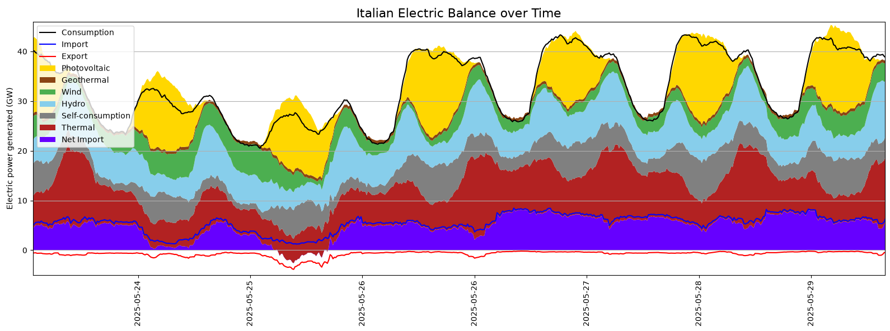
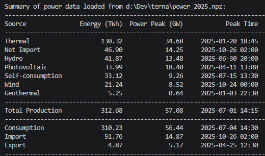
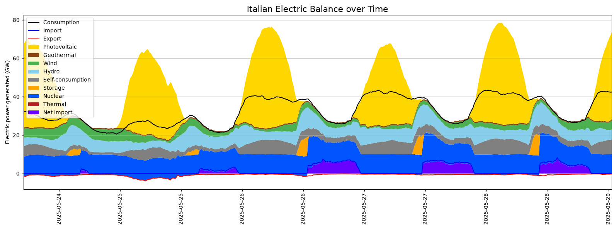
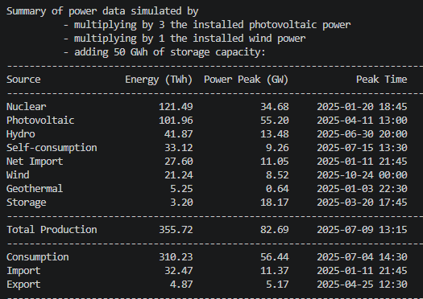

# terna
Analysis and simulation of electricity production in Italy

## Project Summary

This project analyzes and visualizes the Italian electricity budget over a specified period (typically a full year), using data from Terna, the Italian transmission grid operator. It then runs an alternative scenario simulation that explores how increased photovoltaic (PV) and wind generation capacity, combined with energy storage systems, could completely replace thermal (fossil-fueled) generation, and how much storage capacity and photovoltaic and wind generation would be needed to achieve this goal.

---

## Environment Setup

### Prerequisites

- Python 3.11 or later
- A virtual environment (recommended)

### Create and activate the virtual environment

```bash
python -m venv .venv

# Windows
.\.venv\Scripts\activate

# Linux / macOS
source .venv/bin/activate
```

### Install dependencies

```bash
pip install numpy pandas matplotlib
```

## Code execution

### Prepare the data

The project ships with a pre-built `power_2025.npz` binary file ready to use. If you need to rebuild it from the raw CSVs (e.g. after updating any of the source files), run:

```bash
python convert_csv_into_pnz.py
```

This reads `power_generation_2025.csv`, `power_imp_exp_2025.csv`, and `power_consumption_2025.csv`, aligns every source to a common 15-minute time grid, fills missing slots with NaN, merges the three datasets, and saves the result to `power_2025.npz`.

### Run the main script

```bash
python main.py
```

This reads `power_2025.npz` and plots the temporal distribution of each power source in a stacked chart, alongside charts showing power consumption, imports and exports.

<div align="center">
  

  Italian energy balance (year 2025).
</div>

Then it prints a table summarizing energy production over the entire period considered, as well as the peak power and peak time for each source.

<div align="center">
  

  Summary of energy balance.
</div>

The main script also performs a simple simulation of the temporal distribution and energy balance, based on various assumptions (see next section) regarding photovoltaic, wind and nuclear installed power. The simulation results are presented graphically and summarized in tabular form in a similar manner.

---

### Simulation

The simulation answers the question:

> *"If PV capacity were multiplied by a factor **k\_pv**, wind capacity by **k\_w**, and a storage with maximum capacity **C** GWh were added to the grid, how much thermal generation and net import could be avoided? And what if nuclear power is added?"*

#### Parameters

| Parameter | Symbol | Unit | Description |
|---|---|---|---|
| `max_capacity` | $C$ | GWh | Maximum usable storage capacity |
| `k_pv` | $k_{\text{pv}}$ | — | Multiplicative scale factor applied to the historical PV output |
| `k_w` | $k_w$ | — | Multiplicative scale factor applied to the historical wind output |
| `nuke` | — | boolean | Whether a simulated contribution from nuclear power has to be considered |
| `nuclear_base_load_factor` | $f_{\text{nuke}}$ | — | Minimum nuclear output as a fraction of peak nuclear power (= 0.3) |

Storage round-trip efficiency is modelled with separate charge and discharge efficiencies:

$$\eta_{\text{charge}} = \eta_{\text{discharge}} = 0.9$$

#### Simulation assumptions

1. Consumption remains unchanged, as do all other power-related parameters not specified below.

2. Photovoltaic and wind generation are simply multiplied by the respective $k$ factor.

3. Whether possible, excess energy is used to reduce thermal generation and, secondarily, to charge the storage system with a specified charge efficiency $\eta_{\text{charge}}$.

4. Whether possible, stored energy is used to reduce thermal generation and, secondarily, energy import, with a specified discharge efficiency $\eta_{\text{discharge}}$.

5. Storage capacity can never exceed the specified maximum capacity.

In case of added nuclear power:  

6. Residual thermal generation (after all surplus and storage displacements) is completely replaced by nuclear power.

7. Nuclear power cannot be modulated arbitrarily: a minimum base load equal to $f_{\text{nuke}} = 0.3$ of the simulated nuclear peak is enforced.

8. When nuclear base load exceeds the interval demand, the excess first displaces storage discharge (the storage is re-charged accordingly), then reduces energy imports.

#### Step-by-step logic (per 15-minute interval $t$)

The storage state is initialised at full capacity: $C_0 = C$.

1. **Scale renewable sources** — update PV and wind output with their respective scale factors:

$$P_{\text{PV},t}^{\text{new}} = k_{\text{pv}} \cdot P_{\text{PV},t}, \qquad P_{W,t}^{\text{new}} = k_w \cdot P_{W,t}$$

2. **Compute total renewable surplus**:

$$\text{surplus}_t = P_{\text{PV},t} \cdot (k_{\text{pv}} - 1) + P_{W,t} \cdot (k_w - 1)$$

3. **Displace thermal generation** with the surplus:
   - If $\text{surplus}_t > \text{Thermal}_t$: thermal is zeroed and the residual surplus carries over.
   - Otherwise: thermal is reduced by the surplus and the surplus is exhausted.

4. **Displace imports** with the remaining surplus:
   - If $\text{surplus}_t > \text{Import}_t$: imports are zeroed and the residual surplus carries over.
   - Otherwise: imports (and `Net Import`) are reduced by the surplus and the surplus is exhausted.

5. **Charge storage** with any remaining surplus (capped at $C$, excess is curtailed):

$$C_{t+1} = \min\!\left(C_t + \text{surplus} \cdot \frac{\eta_{\text{charge}}}{4},\; C\right)$$

6. **Discharge storage to cover residual thermal demand**:

$$P_{\text{storage},t} = \min\!\left(C_t \cdot 4 \cdot \eta_{\text{discharge}},\; \text{Thermal}_t\right)$$

$$C_{t+1} = C_t - \frac{P_{\text{storage},t}}{4 \cdot \eta_{\text{discharge}}}$$

7. **Discharge storage to cover residual imports** (if storage still has charge):

$$P_{\text{storage},t} \mathrel{+}= \min\!\left(C_t \cdot 4 \cdot \eta_{\text{discharge}},\; \text{Import}_t\right)$$

$$C_{t+1} = C_t - \frac{\Delta P}{4 \cdot \eta_{\text{discharge}}}$$

8. **Assign nuclear** (only if `nuke = True`): the residual thermal output is transferred to nuclear and thermal is zeroed:

$$P_{\text{Nuclear},t} = \text{Thermal}_t, \qquad \text{Thermal}_t = 0$$

#### Nuclear base-load post-processing (only if `nuke = True`)

After the main loop, a nuclear base load is computed as:

$$P_{\text{nuke,base}} = f_{\text{nuke}} \cdot \max_t\!\left(P_{\text{Nuclear},t}\right)$$

For each interval $t$ where $P_{\text{Nuclear},t} < P_{\text{nuke,base}}$, nuclear output is raised to the base load and the shortfall $\delta_t = P_{\text{nuke,base}} - P_{\text{Nuclear},t}$ is absorbed as follows:

1. **Displace storage discharge first** — if $P_{\text{Storage},t} \ge \delta_t$:

$$P_{\text{Storage},t} \mathrel{-}= \delta_t, \qquad C \mathrel{+}= \frac{\delta_t}{4 \cdot \eta_{\text{discharge}}}$$

2. **Otherwise**, storage is fully displaced and the remaining shortfall reduces imports:

$$\delta_t \mathrel{-}= P_{\text{Storage},t}, \quad P_{\text{Storage},t} = 0, \quad P_{\text{Import},t} = \max\!\left(0,\; P_{\text{Import},t} - \delta_t\right)$$

$$P_{\text{Net Import},t} = P_{\text{Import},t} - P_{\text{Export},t}$$

The result is a new `PowerData` that shows the modified mix: reduced (or zeroed) thermal and imports, scaled-up PV and wind, and an additional `Storage` source representing storage discharge.

<div align="center">
  

  Simulated energy balance, with 3 times photovoltaic available power and 50 GWh storage capacity.
</div>
<div align="center">
  

  Summary of simulated energy balance.
</div>

---

## Project Content

### File overview

| File | Description |
|---|---|
| `power_generation_2025.csv` | Raw generation-by-source data exported from the Terna portal |
| `power_imp_exp_2025.csv` | Raw import/export data exported from the Terna portal |
| `power_consumption_2025.csv` | Raw consumption data exported from the Terna portal |
| `convert_csv_into_pnz.py` | One-off script to build `power_2025.npz` from the three CSVs |
| `parameters.py` | Project-wide constants (source list, colours, storage efficiencies) |
| `utility.py` | Data I/O, `PowerData` dataclass, plotting and summary printing |
| `simulator.py` | Core simulation logic (`simulate_surplus`) |
| `main.py` | Entry point: loads data, prints summaries, runs and plots the simulation |

---

### Data representation — `PowerData`

All data is carried around in a single `PowerData` dataclass (defined in `utility.py`):

```
PowerData
├── power_item : dict[str, np.ndarray]   # power values per source/item (GW), one value every 15 min
├── start      : pd.Timestamp            # datetime of the first sample
└── freq       : str                     # sampling interval (default "15min")
```

The generation sources tracked are defined in `parameters.py` as `SOURCES`:

| Source | Description |
|---|---|
| `Thermal` | Gas, coal, and other fossil-fuel plants |
| `Photovoltaic` | Solar PV |
| `Wind` | Onshore and offshore wind |
| `Hydro` | Run-of-river and reservoir hydroelectric |
| `Geothermal` | Geothermal plants |
| `Self-consumption` | Distributed / behind-the-meter generation |
| `Net Import` | Net power imported from abroad (Import − Export) |
| `Nuclear` | Nuclear plants (added by the simulation) |
| `Storage` | Energy storage discharge (added by the simulation) |

In addition, `OTHER_POWER_ITEMS` tracks three complementary series that are loaded from dedicated CSVs and overlaid on the generation chart:

| Item | Description |
|---|---|
| `Consumption` | Total national electricity consumption |
| `Import` | Total gross power imported from abroad |
| `Export` | Total gross power exported abroad |

---

### Utility functions

- **`load_generation_data_from_csv`** — parses the generation CSV, builds a 15-minute time grid from the data's own date range, and returns a `PowerData` object.
- **`load_import_export_data_from_csv`** — parses the import/export CSV, aggregates import and export across all countries, computes `Net Import`, and returns a `PowerData` object.
- **`load_consumption_data_from_csv`** — parses the consumption CSV and returns a `PowerData` object.
- **`merge_power_data`** — merges two or more `PowerData` objects into one, aligning on a common time index and summing arrays that share the same key.
- **`save_power_data_to_npz` / `load_power_data_from_npz`** — persist and restore a `PowerData` (including the start timestamp) using NumPy's compressed `.npz` format.
- **`plot_power_data`** — renders a stacked-area chart of instantaneous power output (GW) over time, overlaying the `Consumption`, `Import`, and `Export` curves, with adaptive x-axis formatting.
- **`print_power_data_summary`** — prints a tabular summary per source showing total energy (TWh), peak instantaneous power (GW), and the timestamp of that peak. The final `Total` row shows the grand total energy and the peak of the combined output across all sources.
