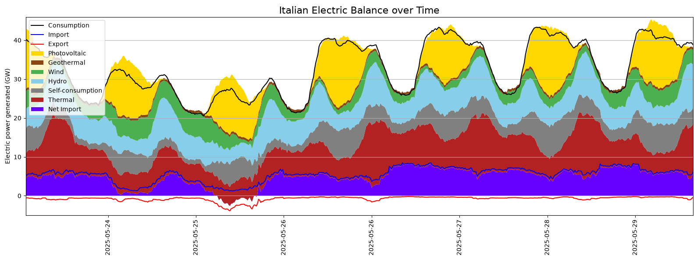
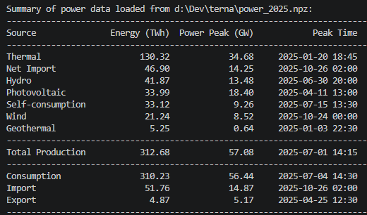
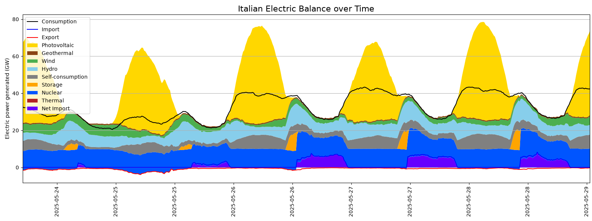
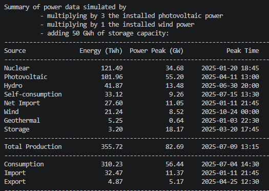
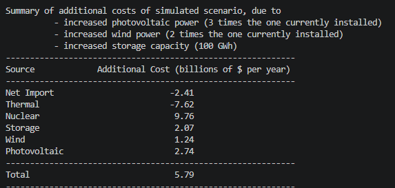

# terna
Analysis and simulation of electricity production in Italy

## Project Summary

This project analyzes and visualizes the Italian electricity budget over a specified period (typically a full year), using data from Terna, the Italian transmission grid operator. It then runs an alternative scenario simulation that explores how increased photovoltaic (PV) and wind generation capacity, combined with energy storage systems, could completely replace thermal (fossil-fueled) generation, and how much storage capacity and photovoltaic and wind generation would be needed to achieve this goal.

---

## Deployment

The webapp is designed around a single entry point in production:
- FastAPI serves all API routes under `/api/*`
- the built React app is served by the same process and same origin

This means both cloud and homelab setups use one public URL and one exposed port.

### Option A — Cloud on Render.com

Render provides managed HTTPS and can deploy this repository directly from `render.yaml`.

1. Fork (or push) this repository to your GitHub account.
2. Open [dashboard.render.com](https://dashboard.render.com) and create a new **Blueprint** service.
3. Select this repository. Render auto-detects `render.yaml`.
4. Click **Apply** to build and deploy.
5. Open `https://<service-name>.onrender.com` once deployment is complete.

What Render runs on each deploy:
- install Python dependencies from `requirements.txt`
- build frontend assets with `npm ci && npm run build`
- regenerate `power_2025.npz` from CSV files
- start FastAPI with `uvicorn backend.api:app --host 0.0.0.0 --port $PORT`

Notes:
- Render free tier spins down after inactivity and may cold-start in about 30 seconds.
- API and frontend are same-origin in this setup, so no separate frontend service is required.

### Option B — Homelab with Docker Compose + Nginx Proxy Manager

Use this when self-hosting on your own machine or NAS.

1. Review `.env`:
  - `TERNA_PORT` (host port, default `5150`)
  - `CORS_ALLOW_ORIGINS` (public URL, for example `https://terna.masciotta.casa`)
  - `RATE_LIMIT_REQUESTS` and `RATE_LIMIT_WINDOW_SECONDS`
2. Build and start:

```bash
docker compose up -d --build
```

3. Verify service:

```bash
docker compose ps
docker compose logs -f terna
```

4. Access locally at `http://<docker-host-ip>:5150` (or your configured `TERNA_PORT`).

5. In Nginx Proxy Manager, create a Proxy Host:
  - Domain Names: your public domain (for example `terna.masciotta.casa`)
  - Scheme: `http`
  - Forward Hostname/IP: Docker host
  - Forward Port: `TERNA_PORT` value (default `5150`)
  - Websockets Support: enabled
  - Block Common Exploits: enabled
  - SSL: Let's Encrypt certificate + Force SSL

Notes:
- The container listens on internal port `8080`; Compose maps it to `TERNA_PORT`.
- API and frontend are served from the same container and domain, so `/api` works without extra proxy rules.
- Runtime hardening in Compose includes `cap_drop: [ALL]` and `no-new-privileges:true`.

---

## Local Environment Setup

To develop locally on Windows, follow these steps to set up a Python virtual environment and install dependencies.

### Prerequisites

- Python 3.11 or later
- A virtual environment (recommended)

### Create and activate the virtual environment

```bash
python -m venv .venv

# Windows
.\.venv\Scripts\activate

# Linux / macOS
source .venv/bin/activate
```

### Install dependencies

```bash
pip install -r requirements.txt
```

## Native C++ Backend on Windows

The web application always uses the Python/FastAPI backend process. The simulation work can be delegated to the optional C++20 extension `_terna_cpp`, while the existing Python implementation remains available as a fallback.

### Prerequisites

- Python 3.11 or later and a project virtual environment in `.venv`
- Node.js, required by `run.bat` for the Vite frontend
- Visual Studio 2022 with the **Desktop development with C++** workload
- The `VsDevCmd.bat` path configured in [build-native.bat](build-native.bat). The repository default is Visual Studio 2022 Professional. Update `VSDEVCMD` in that script when using a different edition or installation location.

### Compile the extension

Run these commands in PowerShell from the project root:

```powershell
.venv\Scripts\python.exe -m pip install -r requirements-dev.txt
.\build-native.bat
```

`requirements-dev.txt` installs the native build dependencies, namely CMake and `pybind11`. The build creates a Python extension compatible with the virtual environment interpreter at:

```text
build\python\Release\_terna_cpp.<python-abi>.pyd
```

For example, Python 3.13 on 64-bit Windows produces `_terna_cpp.cp313-win_amd64.pyd`. Re-run `build-native.bat` whenever the C++ files under `cpp/` change, or after changing Python versions.

### Verify the native build

Make the compiled extension visible to Python, select the native engine, and run the parity tests:

```powershell
$env:PYTHONPATH = "$PWD\build\python\Release;$env:PYTHONPATH"
$env:TERNA_SIMULATION_ENGINE = "cpp"
.venv\Scripts\python.exe -m unittest discover -s tests
```

The tests compare the Python and C++ implementations for a scenario simulation, daylight-saving-time CSV handling, and the decarbonization surface. A successful run reports `OK`.

### Run the local webapp with C++ simulations

In the same PowerShell session, after a successful build, run:

```powershell
$env:PYTHONPATH = "$PWD\build\python\Release;$env:PYTHONPATH"
$env:TERNA_SIMULATION_ENGINE = "cpp"
.\run.bat
```

`run.bat` starts FastAPI at `http://localhost:8000` and Vite at `http://localhost:5174`. It launches the backend in a child `cmd.exe` process, which inherits both environment variables from PowerShell. Therefore FastAPI remains Python-based, but CSV ingestion, scenario simulation, decarbonization surface calculation, and native cost calculation use `_terna_cpp`.

To limit parallel work during the decarbonization-surface calculation, set a positive worker count before running the app. `0` uses the detected CPU concurrency:

```powershell
$env:TERNA_SURFACE_WORKERS = "4"
```

### Python fallback and troubleshooting

Outside Docker, the default engine is Python. To explicitly use the fallback in a new terminal:

```powershell
$env:TERNA_SIMULATION_ENGINE = "python"
.\run.bat
```

If the backend reports that `_terna_cpp` is unavailable, check that the build completed, that `PYTHONPATH` includes `build\python\Release`, and that the extension ABI matches `.venv\Scripts\python.exe`. The extension must be rebuilt after changing interpreter major/minor versions.

The Docker image compiles the extension in a Linux build stage and sets `TERNA_SIMULATION_ENGINE=cpp` by default. The Windows `.pyd` artifact cannot be copied into or used by the Linux Docker image.

## Code execution

### Prepare the data

The project ships with a pre-built `power_2025.npz` binary file ready to use. If you need to rebuild it from the raw CSVs (e.g. after updating any of the source files), run:

```bash
python convert_csv_into_pnz.py
```

This reads `power_generation_2025.csv`, `power_imp_exp_2025.csv`, and `power_consumption_2025.csv`, aligns every source to a common 15-minute time grid, fills missing slots with NaN, merges the three datasets, and saves the result to `power_2025.npz`.

### Run the main script

```bash
python main.py
```

This reads `power_2025.npz` and plots the temporal distribution of each power source in a stacked chart, alongside charts showing power consumption, imports and exports.

<div align="center">
  

  Italian energy balance (year 2025).
</div>

Then it prints a table summarizing energy production over the entire period considered, as well as the peak power and peak time for each source.

<div align="center">
  

  Summary of energy balance.
</div>

The main script also performs a simple simulation of the temporal distribution and energy balance, based on various assumptions (see next section) regarding photovoltaic, wind and nuclear installed power. The simulation results are presented graphically and summarized in tabular form in a similar manner.

---

### Simulation

The simulation answers the question:

> *"If PV capacity were multiplied by a factor **k\_pv**, wind capacity by **k\_w**, and a storage with maximum capacity **C** GWh were added to the grid, how much thermal generation and net import could be avoided? And what if nuclear power is added?"*

#### Parameters

| Parameter | Symbol | Unit | Description |
|---|---|---|---|
| `max_capacity` | $C$ | GWh | Maximum usable storage capacity |
| `k_pv` | $k_{\text{pv}}$ | — | Multiplicative scale factor applied to the historical PV output |
| `k_w` | $k_w$ | — | Multiplicative scale factor applied to the historical wind output |
| `nuke` | — | boolean | Whether a simulated contribution from nuclear power has to be considered |
| `nuclear_base_load_factor` | $f_{\text{nuke}}$ | — | Minimum nuclear output as a fraction of peak nuclear power (= 0.3) |

Storage round-trip efficiency is modelled with separate charge and discharge efficiencies:

$$\eta_{\text{charge}} = \eta_{\text{discharge}} = 0.9$$

#### Simulation assumptions

1. Consumption remains unchanged, as do all other power-related parameters not specified below.

2. Photovoltaic and wind generation are simply multiplied by the respective $k$ factor.

3. Whether possible, excess energy is used to reduce thermal generation and, secondarily, to charge the storage system with a specified charge efficiency $\eta_{\text{charge}}$.

4. Whether possible, stored energy is used to reduce thermal generation and, secondarily, energy import, with a specified discharge efficiency $\eta_{\text{discharge}}$.

5. Storage capacity can never exceed the specified maximum capacity.

In case of added nuclear power:  

6. Residual thermal generation (after all surplus and storage displacements) is completely replaced by nuclear power.

7. Nuclear power cannot be modulated arbitrarily: a minimum base load equal to $f_{\text{nuke}} = 0.3$ of the simulated nuclear peak is enforced.

8. When nuclear base load exceeds the interval demand, the excess first displaces storage discharge (the storage is re-charged accordingly), then reduces energy imports.

#### Step-by-step logic (per 15-minute interval $t$)

The storage state is initialised at full capacity: $C_0 = C$.

1. **Scale renewable sources** — update PV and wind output with their respective scale factors:

$$P_{\text{PV},t}^{\text{new}} = k_{\text{pv}} \cdot P_{\text{PV},t}, \qquad P_{W,t}^{\text{new}} = k_w \cdot P_{W,t}$$

2. **Compute total renewable surplus**:

$$\text{surplus}_t = P_{\text{PV},t} \cdot (k_{\text{pv}} - 1) + P_{W,t} \cdot (k_w - 1)$$

3. **Displace thermal generation** with the surplus:
   - If $\text{surplus}_t > \text{Thermal}_t$: thermal is zeroed and the residual surplus carries over.
   - Otherwise: thermal is reduced by the surplus and the surplus is exhausted.

4. **Displace imports** with the remaining surplus:
   - If $\text{surplus}_t > \text{Import}_t$: imports are zeroed and the residual surplus carries over.
   - Otherwise: imports (and `Net Import`) are reduced by the surplus and the surplus is exhausted.

5. **Charge storage** with any remaining surplus (capped at $C$, excess is curtailed):

$$C_{t+1} = \min\!\left(C_t + \text{surplus} \cdot \frac{\eta_{\text{charge}}}{4},\; C\right)$$

6. **Discharge storage to cover residual thermal demand**:

$$P_{\text{storage},t} = \min\!\left(C_t \cdot 4 \cdot \eta_{\text{discharge}},\; \text{Thermal}_t\right)$$

$$C_{t+1} = C_t - \frac{P_{\text{storage},t}}{4 \cdot \eta_{\text{discharge}}}$$

7. **Discharge storage to cover residual imports** (if storage still has charge):

$$P_{\text{storage},t} \mathrel{+}= \min\!\left(C_t \cdot 4 \cdot \eta_{\text{discharge}},\; \text{Import}_t\right)$$

$$C_{t+1} = C_t - \frac{\Delta P}{4 \cdot \eta_{\text{discharge}}}$$

8. **Assign nuclear** (only if `nuke = True`): the residual thermal output is transferred to nuclear and thermal is zeroed:

$$P_{\text{Nuclear},t} = \text{Thermal}_t, \qquad \text{Thermal}_t = 0$$

#### Nuclear base-load post-processing (only if `nuke = True`)

After the main loop, a nuclear base load is computed as:

$$P_{\text{nuke,base}} = f_{\text{nuke}} \cdot \max_t\!\left(P_{\text{Nuclear},t}\right)$$

For each interval $t$ where $P_{\text{Nuclear},t} < P_{\text{nuke,base}}$, nuclear output is raised to the base load and the shortfall $\delta_t = P_{\text{nuke,base}} - P_{\text{Nuclear},t}$ is absorbed as follows:

1. **Displace storage discharge first** — if $P_{\text{Storage},t} \ge \delta_t$:

$$P_{\text{Storage},t} \mathrel{-}= \delta_t, \qquad C \mathrel{+}= \frac{\delta_t}{4 \cdot \eta_{\text{discharge}}}$$

2. **Otherwise**, storage is fully displaced and the remaining shortfall reduces imports:

$$\delta_t \mathrel{-}= P_{\text{Storage},t}, \quad P_{\text{Storage},t} = 0, \quad P_{\text{Import},t} = \max\!\left(0,\; P_{\text{Import},t} - \delta_t\right)$$

$$P_{\text{Net Import},t} = P_{\text{Import},t} - P_{\text{Export},t}$$

The result is a new `PowerData` that shows the modified mix: reduced (or zeroed) thermal and imports, scaled-up PV and wind, and an additional `Storage` source representing storage discharge.

<div align="center">
  

  Simulated energy balance, with 3 times photovoltaic available power and 50 GWh storage capacity.
</div>
<div align="center">
  

  Summary of simulated energy balance.
</div>

---

### Cost Computation

The function computes the annualised cost difference of the simulated scenario with respect to the real one. All costs are expressed in 2024 euros and are annualised to the simulated period. The model uses a consistent Italian/European baseline for new capacity: plant-level costs, before taxes, transmission/distribution, and wider system-integration costs.

LCOE is useful for comparing the lifetime cost of generation but does not measure system value, dispatchability, or balancing requirements. It must therefore be interpreted together with the time-series simulation, rather than as a complete electricity-system cost. The generation values are central estimates based on the [IEA/NEA Projected Costs of Generating Electricity](https://www.iea.org/reports/projected-costs-of-generating-electricity-2020) and [IRENA Renewable Power Generation Costs in 2023](https://www.irena.org/Publications/2024/Sep/Renewable-Power-Generation-Costs-in-2023), adjusted to Italian conditions. They are deliberately configurable through the API.

| Source | Assumed cost | Unit | Assumption |
|---|---:|---|---|
| Net Import | 89 | €/MWh | 2024 Italian gross-import unit value |
| Thermal | 110 | €/MWh | Natural-gas combined-cycle generation, representative of the Italian thermal fleet |
| Nuclear | 160 | €/MWh | New European nuclear build; no Italian operating fleet exists |
| Photovoltaic | 55 | €/MWh | Italian utility-scale photovoltaic project |
| Wind | 70 | €/MWh | Italian onshore wind project; offshore is excluded |
| Self-consumption | 85 | €/MWh | Distributed behind-the-meter photovoltaic generation, not avoided retail expenditure |
| Hydro | 95 | €/MWh | New hydropower project; highly site-specific |
| Geothermal | 90 | €/MWh | New high-enthalpy geothermal project; highly site-specific |
| Storage capacity | 40,000 | €/MWh-capacity/year | Annualised grid-scale lithium-ion battery CAPEX, replacements and fixed O&M |
| Storage discharge | 0 | €/MWh discharged | Variable operating cost; charging energy is already priced in the generation source |

The import value is derived from [WITS/UN Comtrade](https://wits.worldbank.org/trade/comtrade/en/country/ITA/year/2024/tradeflow/Imports/partner/ALL/product/271600): $5.6022 billion of electrical-energy imports and 58.3145 TWh in 2024, or $96.07/MWh. Converted using the 2024 ECB average exchange rate of $1.0824 per euro, this is €88.8/MWh, rounded to €89/MWh. Terna reports 55.9 TWh of gross imports and 51.0 TWh of net imports in 2024; the small quantity difference reflects different statistical reporting boundaries.

Storage needs a separate treatment. The [PNNL LCOS methodology](https://www.pnnl.gov/projects/esgc-cost-performance/lcos-estimates) defines LCOS as a cost per unit of discharged energy throughput and includes capital, replacement and O&M assumptions. Applying such a figure only to discharged energy would make a large but underused store artificially cheap. The simulator therefore uses two non-overlapping terms:

$$C_{storage} = E_{capacity} \times 40{,}000\ \frac{EUR}{MWh_{capacity}\cdot year} + E_{discharged} \times 0\ \frac{EUR}{MWh}$$

The first term is incurred regardless of utilisation and represents annualised CAPEX, replacement and fixed O&M for a four-hour grid-scale lithium-ion battery. Thus, 1 TWh of capacity costs 40 G€/year even with zero discharge. The second term is available for non-capital variable O&M; its default is zero. Charging energy is excluded to avoid double counting because it is already costed as generation from the source that charged the storage.

<div align="center">
  

  Summary of simulated scenario differential costs.
</div>

---
